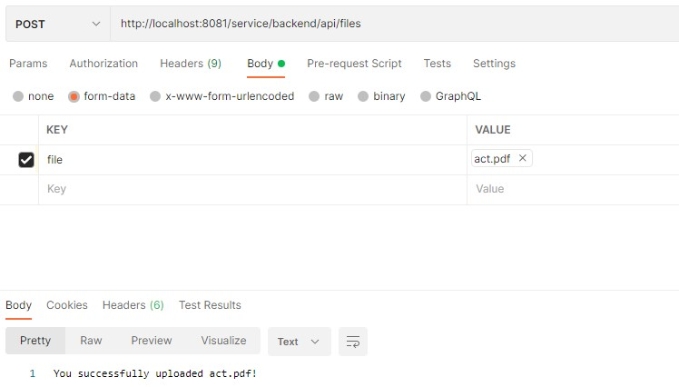
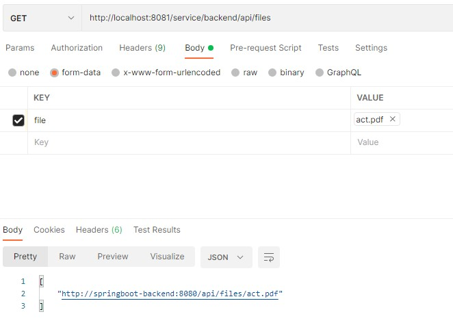
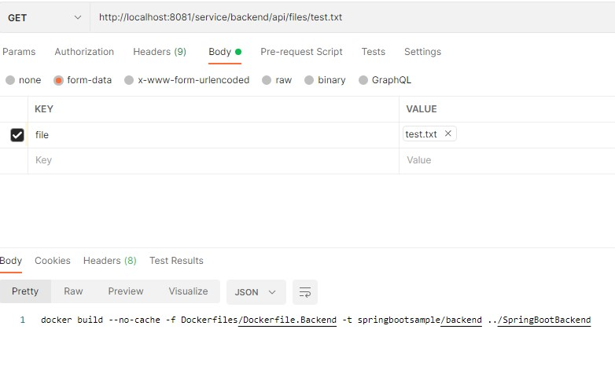

Java бэкенд на основе фреймворка Spring Boot
Проект получен с помощью сервиса https://start.spring.io/
Для работы с проектом рекомендуется использовать IntelliJ IDEA не ниже версии 2022.1

Общая схема взаимодействия:

Возможности, реализованные на данный момент:

1) Работа с БД Postgres. Для примера созданы сущности Customer и Comment.
2) Выполнение простых REST запросов к сущностям - GET, POST, PUT, DELETE.
3) Связи между сущностями. Comment является детейлом Customer. Решена цикличность запроса Детейл-Мастер-Детейл-Мастер....
4) Аудит операций на основе Envers. Для каждой таблицы автоматически создается таблица аудита в этой же БД + одна общая служебная таблица.
5) Сложный запрос на основе нескольких параметров - выборка комментариев в заданном периоде времени.
6) Система логировани с возможностью назначать свои тексты на разные типы ошибок.
7) Система сбора логов [Loki](/docs/%D0%9E%D1%82%D0%BF%D1%80%D0%B0%D0%B2%D0%BA%D0%B0%20%D0%BB%D0%BE%D0%B3%D0%BE%D0%B2%20%D0%B8%D0%B7%20%D0%B1%D1%8D%D0%BA%D0%B5%D0%BD%D0%B4%D0%B0%20%D0%B2%20loki.md).
8) Работа с файлами - Загрузка/Выгрузка.
9) Реализация фильтра по нескольким параметрам. Число параметров модели для фильтра любое, но в качестве примера реализован только тип сравнения "="(equal).
10) Запуск в Docker.
11) Синхронизация данных для поиска и отправка метрик приложения в поисковую систему [ELasticsearch](/docs/%D0%9E%D1%82%D0%BF%D1%80%D0%B0%D0%B2%D0%BA%D0%B0%20%D0%B4%D0%B0%D0%BD%D0%BD%D1%8B%D1%85%20%D0%B2%20Elasticsearch.md).
12) Отправка потоковых данных в программный брокер сообщений kafka.
13) Сервис для интерактивного просмотра документации [Swagger](/docs/%D0%A1%D0%B5%D1%80%D0%B2%D0%B8%D1%81%20%D0%B4%D0%BE%D0%BA%D1%83%D0%BC%D0%B5%D0%BD%D1%82%D0%B0%D1%86%D0%B8%D0%B8%20(Swagger%20%2B%20SpringDoc).md).
14) Платформа с открытым исходным кодом для визуализации, мониторинга и анализа данных Grafana.
15) [Spring Cloud Gateway](/docs/Spring%20Cloud%20Gateway.md) - прокси-сервис, через который проходятвсе запросы. Выступает единственной точкой входа для пользователя.

### Запуск в Docker

Для запуска бэкенда в Docker необходимо выполнить

`Flexberry.SpringReactApplication.Sample\Docker\build.sh`

`Flexberry.SpringReactApplication.Sample\Docker\run.cmd`

Для остановки контейнера

`Flexberry.SpringReactApplication.Sample\Docker\stop.cmd`

### Примеры запросов

Запросы выполняются в Postman

### Пример POST для детейла

### Запрос на выборку комментариев в диапазоне дат

### Запрос с фильтром

### Примеры запросов для работы с файлами

Загрузить файл:

Получить список файлов:

Скачать указанный файл:

### Сервис документации Swagger

localhost:8081/service/docs
