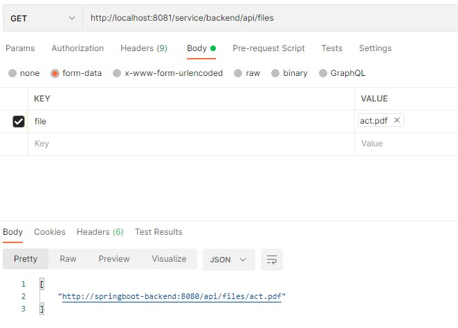

# Создание API для работы с файлами SpringBoot проекта.

## Пример реализации

Были добавлены следующие файлы:

net.flexberry.flexberrySampleSpring.service.**StorageService** - сервис для работы с файловой системой, содержитметоды для перечисления файлов, сохранения и загрузки содержимого файла.

В стартовый класс net.flexberry.flexberrySampleSpring.**FlexberrySampleSpringApplication** добавлен метод **init()**, **StorageService.init** создается директория для файлов.

net.flexberry.flexberrySampleSpring.controllers.**FileUploadController** - контроллер для получения списка файлов, загрузки файла через **POST** и скачивания через **GET**-запрос по имени файла, по большей части представляет собой web-бертку для **StorageService**. Примеры запросов приведены ниже.

Кастомные классы исключений. Используются чтобы прокинуть исключения из сервиса **StorageService**:
* net.flexberry.flexberrySampleSpring.exceptions.**StorageException**
* net.flexberry.flexberrySampleSpring.exceptions.**StorageFileException**
Обработка осуществляется централизовано в контроллере через метод с атрибутом:
```cs
@ExceptionHandler(StorageFileNotFoundException.class)
```

В **application.properties** добавлены параметры для увеличения максимальных размеров  загружаемых файлов и запросов:
* spring.servlet.multipart.max-file-size=128MB
* spring.servlet.multipart.max-request-size=128MB

## Расширенный пример

За основу был взят официальный пример: https://spring.io/guides/gs/uploading-files/
также оттуда можно взять веб-часть для скачивания и загрузки файлов.

### Примеры запросов для работы с файлами

Загрузить файл:


Получить список файлов:



Скачать указанный файл:

