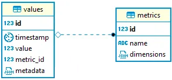

# Метрики Micrometer

Micrometer предоставляет метрический фасад, который отображает метрические данные в независимом от поставщика формате, понятном системе мониторинга.

Micrometer не является частью экосистемы Spring и должен быть добавлен в качестве зависимости.

Файл **pom.xml**
```xml
<dependency>
    <groupId>org.springframework.boot</groupId>
    <artifactId>spring-boot-starter-actuator</artifactId>
</dependency>

<dependency>
    <groupId>io.micrometer</groupId>
    <artifactId>micrometer-core</artifactId>
</dependency>
```

Пакет **Spring Boot Actuator** является расширанием функций **Micrometer Core** и привносит в наше приложение готовые к работе функции.

Основное преимущество этой библиотеки заключается в том, что мы можем получить инструменты производственного уровня без необходимости реализовывать эти функции самостоятельно.

Actuator в основном используется для предоставления оперативной информации о запущенном приложении — работоспособности, метриках, информации, дампе, окружении и т. д. Он использует конечные точки HTTP или JMX-бины, чтобы мы могли взаимодействовать с ним.

[Список предопределенных конечных точек для Spring Boot Actuator](https://www.baeldung.com/spring-boot-actuators#3-predefined-endpoints)

Нас интересуют именно метрики (metrics). Вот почему файл конигурации этих настроек начинается с management.metrics.

Настраиваем метрики, файл **application.properties**
```ini
management.metrics.distribution.percentiles-histogram.http.server.requests=true
management.metrics.distribution.sla.http.server.requests=100ms, 400ms, 500ms, 2000ms
management.metrics.distribution.percentiles.http.server.requests=0.5, 0.9, 0.95, 0.99
```
- **management.metrics.distribution.percentiles-histogram**.http.server.requests — публиковать ли процентные диаграммы для данных из раздела **http.server.requests**
- **management.metrics.distribution.sla**.http.server.requests — конкретные целевые границы уровня обслуживания для данных из раздела **http.server.requests**
- **management.metrics.distribution.percentiles**.http.server.requests — конкретные вычисляемые неагрегируемые процентили для отправки в серверную часть для данных из раздела **http.server.requests**

## Отправка метрик в БД PostgreSQL

Структура БД для метрик. Все таблицы были добавлены в схему **metric** вместо public.



Таблица **metrics**:
- **name** - Строка. Имя метрики.
- **dimensions** - JSON. Дополнительная информация по метрике.

Таблица **values**:
- **timestamp** - Время с указанием часового пояса. Время фиксации значения метрики.
- **value** - Вещественное число. Значение метрики.
- **metric_id** - Целое. Идентификатор метрики из таблицы metrics.
- **metadata** - JSON. Дополнительные данные значения метрики.

## Перехват метрик

Для перехвата метрик от micrometer необходимо добавить три файла:
- **MetricConfig** - реализация интерфейса **StepRegistryConfig**, общие параметры конфигурации для любого реестра, который отправляет агрегированные показатели через регулярные промежутки времени.
- **MetricRegistry** - реализация интерфейса **StepMeterRegistry**, сам реестр, который ступенчато нормализует подсчеты и суммы до скорости в секунду в течение интервала публикации.

Для записи в БД используем прямое обращение через запрос:
```java
// Запись метрики в БД.
Integer metricId = getMetricId(name, dimension);

saveMetricValue(metricId, value, wallTime, metadata);

...

private Integer getMetricId(String name, String dimensions) {
        Integer id = -1;

        // Получаем ID метрики.
        try {
            id = jdbcTemplate.queryForObject("SELECT id FROM metric.metrics WHERE name = ?", Integer.class, name);
        } catch (EmptyResultDataAccessException e) {
            loggingService.LogTrace("Metric '" + name + "' not found");
        }

        // Если метрики нет, то мы ее создаем.
        if (id == null || id < 0) {
            jdbcTemplate.update("INSERT INTO metric.metrics (\"name\", \"dimensions\") " +
                "VALUES (?, ? ::jsonb)", name, dimensions);

            id = jdbcTemplate.queryForObject("SELECT id FROM metric.metrics WHERE name = ?", Integer.class, name);
        }

        return id;
    }

    private void saveMetricValue(Integer metricId, double value, long wallTime, String metadata) {
        // Запись значения метрики.
        jdbcTemplate.update("INSERT INTO metric.\"values\" (\"metric_id\", \"value\", \"timestamp\", \"metadata\") " +
            "VALUES (?, ?, to_timestamp(?), ? ::json)", metricId, value, wallTime, metadata);
    }

```

- **MetricClientConfig** - конфигурация регистратора метрик, где мы указываем наш MetricConfig и MetricRegistry.

```java
@Configuration
public class MetricClientConfig {
    @Bean
    public MetricRegistry getMetricRegistry() {
        return new MetricRegistry(new MetricConfig(), Clock.SYSTEM);
    }
}
```