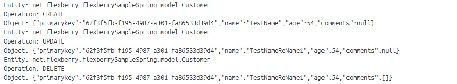
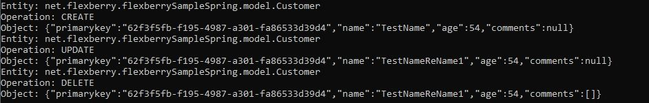
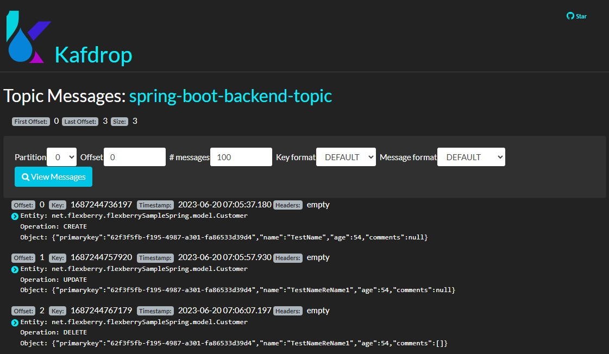

# Отправка потоковых данных в Apache Kafka
# Об Apache Kafka
[**Apache Kafka**](https://kafka.apache.org/) – распределённый программный брокер сообщений с открытым исходным кодом, разрабатываемый в рамках фонда Apache на языках Java и Scala. Основной целью проекта является создание горизонтально масштабируемой платформы для обработки потоковых данных в реальном времени с высокой пропускной способностью и низкой задержкой. Kafka может подключаться к внешним системам (для импорта и экспорта данных) через Kafka Connect, а также может использоваться в задачах больших данных при помощи библиотеки Kafka Streams. Использует собственный двоичный протокол передачи данных на основе TCP, группирующий сообщения для снижения накладных расходов на сеть.

Kafka Connect (или Connect API) – фреймворк для импорта данных из других систем и для экспортирования данных в другие системы. 

Kafka Streams (Streams API) – библиотека потоковой обработки данных, написанная на Java, позволяет создавать в функциональном стиле приложения потоковой обработки данных с поддержкой агрегации, преобразования и анализа данных, получаемых из Kafka-тем.


Kafka хранит сообщения, которые поступают от других процессов, называемых «производителями» (producers), в формате «ключ-значение». Данные могут быть разбиты на разделы (partitions) в рамках разных тем (topics). Внутри раздела сообщения строго упорядочены по их смещениям (offset), то есть по положению сообщения внутри раздела, а также индексируются и сохраняются вместе с временем создания. Другие процессы, называемые «потребителями» (consumers), могут считывать сообщения из разделов.

Система работает в кластере из одного или нескольких узлов-брокеров, где разделы всех тем распределены по узлам кластера. Для обеспечения отказоустойчивости разделы реплицируются на несколько брокеров. 

Kafka поддерживает два типа тем: обычные и компактные. Обычные темы можно настроить с указанием срока хранения или ограничения по максимальному занимаемому пространству. Значения в компактных темах не содержат срока хранения и не зависят ограничений памяти, вместо этого Kafka хранит и обрабатывает только самые новые значения для каждого ключа и гарантирует, что никогда не удалит последнее сообщение для каждого ключа. 

В Kafka есть пять основных API-интерфейсов:
- Producer API – для отправки сообщений в брокер;
- Consumer API – подписка на темы и получение сообщений из брокера;
- Connector API – подключение к системе и многократное использование Producer API и Consumer API;
- Streams API – преобразование входных потоков данных в выходные;
- Admin API – управление темами, брокерами и другими объектами.


## Отправка данных в Apache Kafka
### Зависимости
Первое, что нужно сделать – это подключить необходимые зависимости.
```xml
<dependency>
	<groupId>org.springframework.kafka</groupId>
	<artifactId>spring-kafka</artifactId>
	<version>3.0.7</version>
</dependency>
```

### Сервис взаимодействия с Apache Kafka
Второе – реализовать сервис взаимодействия с Apache Kafka
```java
@Service
public class KafkaProducerService {    
    ...
}
```
В котором реализовать следующие методы.
1. Метод для конфигурирования «производителя» (producer) сообщений.
```java
private Producer<String, String> createProducer() {
    Properties props = new Properties();
    props.put(ProducerConfig.BOOTSTRAP_SERVERS_CONFIG, bootstrapServers);
    props.put(ProducerConfig.CLIENT_ID_CONFIG, clientId);
    props.put(ProducerConfig.KEY_SERIALIZER_CLASS_CONFIG, StringSerializer.class.getName());
    props.put(ProducerConfig.VALUE_SERIALIZER_CLASS_CONFIG, StringSerializer.class.getName());

    return new KafkaProducer<>(props);
}
```

2. Метод отправки сообщений с предопределенными ранее настройками.
```java
void runProducer(String... args) throws Exception {
    
    ...
  
    final Producer<String, String> producer = createProducer();
    long time = System.currentTimeMillis();

    try {
        for (int index = 0; index < args.length; index++) {
            final ProducerRecord<String, String> producerRecord = new ProducerRecord<>(topic, String.valueOf(time + index), args[index]);

            RecordMetadata metadata = producer.send(producerRecord).get();
            ...
        }
    } finally {
        producer.flush();
        producer.close();
    }
}
```


3. Кроме того, можно отдельно реализовать методы для отправки сообщений определённого формата.
```java
public void sendMessageToKafka(String... args) {
    try {
        runProducer(args);
    } catch (Exception e) {
        throw new RuntimeException(e);
    }
}

public void sendObjectOperationToKafka(String operation, Object object) {
    ObjectMapper mapper = new ObjectMapper();
    try {
        String jsonString = mapper.writeValueAsString(object);
        sendMessageToKafka("Entity: " + object.getClass().getName()+ "\n" +
                "Operation: " + operation +"\n" +
                "Object: " + jsonString);
    } catch (JsonProcessingException e) {
        throw new RuntimeException(e);
    }
}
```

### Пример отправки сообщения
Для отправки сообщения брокеру Apache Kafka, достаточно вызвать нужный метод.
```java
public class CustomerController {
    ...
    private final KafkaProducerService kafkaProducerService;

    public CustomerController(CustomerService service, KafkaProducerService kafkaProducerService) {
        ...
        this.kafkaProducerService = kafkaProducerService;
    }
    ...
    public Customer addCustomer(@RequestBody Customer customer) {
        Customer newCustomer = service.saveOrUpdateCustomer(customer);

        try {
            kafkaProducerService.sendObjectOperationToKafka("CREATE", newCustomer);
        } catch (Exception e) {
            ...
        }
        ...
    }
```


## Просмотр данных, полученных Apache Kafka
Для просмотра данных возможны 2 подхода:
1. С помощью консоли.
2. С помощью сторонних решений.

### Просмотр данных с помощью консоли
При работающем контейнере брокера сообщений Apache Kafka, для просмотра полученных данных по конкретной теме (topic), подходит один следующих способов:  
1. Выполнить в терминале работающего контейнера:

```
kafka-console-consumer --bootstrap-server broker:9092 --topic spring-boot-backend-topic --from-beginning
```


2. Выполнить в командной строке ОС Windows:
```
docker exec --interactive --tty docker-broker-1 kafka-console-consumer --bootstrap-server broker:9092 --topic spring-boot-backend-topic --from-beginning
```


В данных примерах команд:
- `docker-broker-1` – имя докер-контейнера.
- `broker:9092` – внешний доступный адрес брокер сообщений Apache Kafka.
- `spring-boot-backend-topic` – тема, которой соответствуют сообщения.


### Просмотр данных через стороннее решение
Существует возможность просмотра данных, полученных Apache Kafka, и с помощью сторонних решений, среди которых есть как платные, так и бесплатные. Более подробно можно ознакомиться в статье [Как следить за Kafka-кластером: 8 полезных инструментов](https://www.bigdataschool.ru/blog/administrative-tools-to-monitor-kafka-clusters.html).
Из рассмотренных в статье продуктов, наиболее простым вариантом для развертывания и последующего просмотра сообщений Apache Kafka оказался [Kafdrop](https://github.com/HomeAdvisor/Kafdrop).




## Источники
1. [Описание Apache Kafka](https://ru.wikipedia.org/wiki/Apache_Kafka)
2. [Kafka Documentation](https://kafka.apache.org/documentation/)
3. [Apache Kafka® Quick Start / Docker](https://developer.confluent.io/quickstart/kafka-docker/)