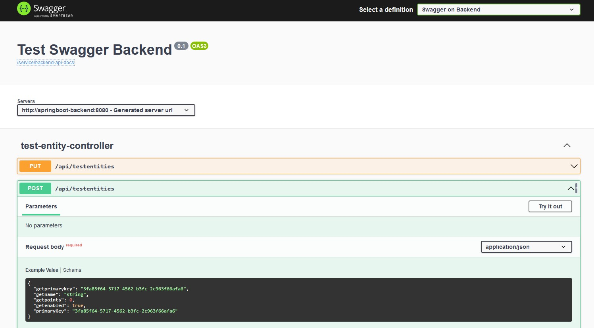

# Сервис документации (Swagger + SpringDoc)

В данном примере реализован сервис документации на основе связки нескольких инструментов:

- **Swagger** - интерфейс документации
- **SpringDoc OpenApi** - библиотека Spring, поддерживающая стандарт документации OpenApi3
- **classgraph**, **webjars-locator-core**, **webjars-locator-core** - вспомогательные библиотеки для составления автодокументации

Все эти компоненты объединены в starter

Для mvc:

```xml
<dependency>
	<groupId>org.springdoc</groupId>
	<artifactId>springdoc-openapi-starter-webmvc-ui</artifactId>
	<version>2.0.2</version>
</dependency>
```

Для webflux:

```xml
<dependency>
	<groupId>org.springframework.boot</groupId>
	<artifactId>spring-boot-starter-webflux</artifactId>
</dependency>

<dependency>
	<groupId>org.springdoc</groupId>
	<artifactId>springdoc-openapi-starter-webflux-ui</artifactId>
	<version>2.1.0</version>
</dependency>
```

В текущем примере сервис встроен в SpringBoot-приложение Spring Cloud Gateway, в котором используется springdoc-openapi-starter-webflux-ui. Именно тут запущен Swagger. Решение объединить gateway и Swagger встречается часто.

## Swagger

Это инструмент для интерактивного просмотра документации (в данном случае стандарт OpenApi3).
Он добавляется в SpringBoot-приложение в составе пакета springdoc-openapi-starter-webflux-ui, после чего можно зайти по ссылке **/swagger-ui.html** и увидеть Web-интерфейс Swagger



Swagger может запрашивать Api у разных сервисов, тем самым в микросервисной схеме достаточно иметь один сервис Swagger, который объединяет всю документацию в одном интерфейсе.
У Swagger есть возможности организации интерфейса - документацию разных сервисов можно группировать и выстраивать иерархию. В код можно добавлять специальные Swagger-аннотации для расширения описаний Api.

## SpringDoc

Springdoc-openapi это java-библиотека, которая помогает автоматизировать создание документации API в проектах SpringBoot. Springdoc-openapiр исследует приложение во время выполнения, чтобы сделать вывод о семантике API на основе конфигураций Spring, структуры классов и различных аннотаций.

Автоматически создает документацию в форматах JSON/YAML и HTML API. Эта документация может быть дополнена комментариями с использованием аннотаций swagger-api.

**Поддерживает**:

- OpenAPI 3

- Spring-boot (v1, v2 and v3)

- JSR-303, specifically for @NotNull, @Min, @Max, and @Size.

- Swagger-ui

- OAuth 2

- GraalVM native images

## Реализация сервиса документации в Flexberry.SpringBootBackend.Sample

В sample-репозитории Swagger работает в сервисе SpringCloudGateway. Он собирает автодокументацию как в самом SpringCloudGateway(добавлен один тестовый контроллер), так и в SpringBootBackend. В SpringBootBackend для формирования документации установлены аналогичные компоненты, но сам интерфейс выключен.

**SpringCloudGateway**

1) Добавим зависимости

```xml
<dependency>
	<groupId>org.springframework.boot</groupId>
	<artifactId>spring-boot-starter-webflux</artifactId>
</dependency>

<dependency>
	<groupId>org.springdoc</groupId>
	<artifactId>springdoc-openapi-starter-webflux-ui</artifactId>
	<version>2.1.0</version>
</dependency>
```

2) Добавим конфиг package net.flexberry.flexberryspringcloudgateway.configuration.SwaggerConfig

```java
package net.flexberry.flexberryspringcloudgateway.configuration;

import io.swagger.v3.oas.annotations.OpenAPIDefinition;
import io.swagger.v3.oas.models.OpenAPI;
import io.swagger.v3.oas.models.info.Info;
import org.springframework.context.annotation.Bean;
import org.springframework.context.annotation.Configuration;

@Configuration
@OpenAPIDefinition
public class SwaggerConfig {
    @Bean
    public OpenAPI baseOpenAPI(){
        return new OpenAPI().info(new Info().title("Test Swagger on Gateway").version("0.1"));
    }
}
```

3) Пропишем конфигурацию в application.yml

```yaml
springdoc:
  packagesToScan: net.flexberry
  api-docs:
    enabled: true
  swagger-ui:
    enabled: true
    use-root-path: true
    urls:
      - url: /v3/api-docs
        name: Swagger on Gateway
      - url: /service/backend-api-docs
        name: Swagger on Backend
```

В разделе urls добавлено две ссылки на документации. Первая ведет к собственной документации SpringCloudGateway, а вторая к документации в сервисе SpringBootBackend.
Но ссылка на SpringBootBackend сделана через gateway (т.к напрямую обратиться не вышло из-за Cors). За документацией SpringBootBackend swagger обращается в свой же gateway, но по пути /service/backend-api-docs. Для этого в gateway задан специальный роут.

```yaml
spring:
  cloud:
    gateway:
      routes:
        - id: swagger api docs on backend
          uri: http://springboot-backend:8080
          predicates:
            - Path=/service/backend-api-docs
          filters:
            - RewritePath=/service/backend-api-docs, /v3/api-docs
```

**SpringBootBackend**

Все аналогично, за исключением двух моментов:

1) В данном случае используется зависимость

```xml
<dependency>
	<groupId>org.springdoc</groupId>
	<artifactId>springdoc-openapi-starter-webmvc-ui</artifactId>
	<version>2.0.2</version>
</dependency>
```

2) application.yml

```yaml
springdoc:
  packagesToScan: net.flexberry
  api-docs:
    enabled: true
  swagger-ui:
    enabled: false
    use-root-path: true
```

3) В контроллерах SpringBootBackend для методов используются специальные аннотации автодокументации:

@Operation

```java
@Operation(summary = "Delete comment with primary key")
@DeleteMapping("/comments/{primaryKey}")
public void deleteComment(@PathVariable("primaryKey") UUID primaryKey) {
    service.deleteCommentByPrimaryKey(primaryKey);
}
```

@Parameter

```java
@Operation(summary = "Get customer by custom filters")
@GetMapping("/filteringCustomers")
@Parameter(
    description ="""
		JSON for example 
        [
            {
                "dataType": "string",
                "compareType": "eq",
                "value": "Vasia",
                "field": "name"
            }
            {
                "dataType": "numeric",
                "compareType": "eq",
                "value": 31,
                "field": "age"
            }
        ]
        """,
    name = "conditions")
public List<Customer> getCommentsForPeriod(@RequestBody List<Condition> conditions) {
	return service.getFilteringCustomers(conditions);
}
```


*ссылки на статьи*

[Официальный ресурс Swagger](https://swagger.io/)

[Официальный ресурс Springdoc](https://springdoc.org/)

[Статья 1 по запуску Swagger в Springboot](https://www.appsdeveloperblog.com/document-spring-rest-api-with-openapi-3swagger/)

[Статья 2 по запуску Swagger в Springboot](https://medium.com/@oguz.topal/central-swagger-in-spring-cloud-gateway-697a1c37b03d)

[Статья 3 по запуску Swagger в Springboot](https://medium.com/@pubuduc.14/swagger-openapi-specification-3-integration-with-spring-cloud-gateway-part-2-1d670d4ab69a)

